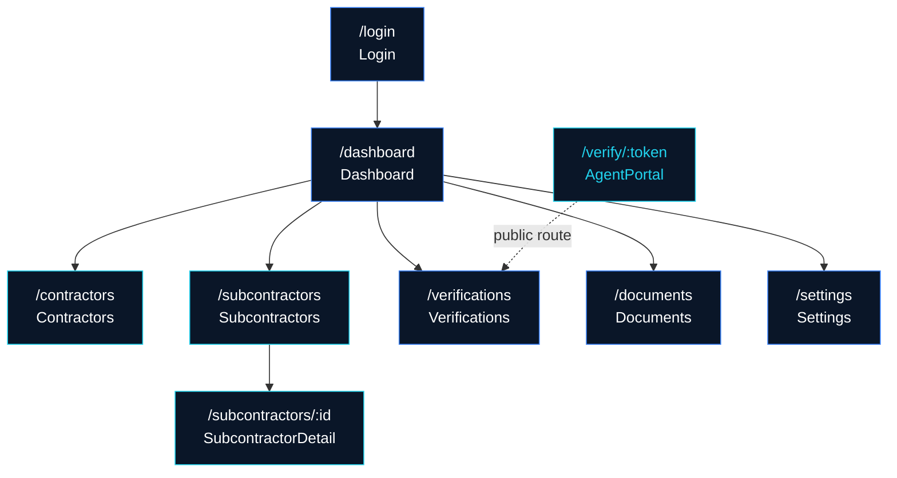

<p align="center">
  
  <br />
  
  
  
  
</p>

# CoverVerifi

**Multi-tenant SaaS platform for automating subcontractor insurance compliance tracking.** CoverVerifi helps construction consultants and general contractors manage, verify, and monitor subcontractor insurance certificates in real time. The platform eliminates manual spreadsheet tracking by providing automated compliance workflows, document management, expiration alerts, and a self-service agent verification portal -- reducing risk exposure and keeping every project audit-ready.

---

## Route Structure



---

## Getting Started

### Prerequisites

- **Node.js** 18+ (LTS recommended)
- **npm** (ships with Node)

### Install

```bash
npm install
```

### Development

```bash
npm run dev
```

The app will be available at `http://localhost:5173`.

### Production Build

```bash
npm run build
```

The optimized output will be written to the `dist/` directory.

---

## Tech Stack

| Technology       | Role      | Version |
| ---------------- | --------- | ------- |
| React            | UI        | 18      |
| React Router     | Routing   | 7       |
| TailwindCSS      | Styling   | 4       |
| Vite             | Build     | 6       |
| Lucide React     | Icons     | latest  |

---

## Project Structure

```
src/
├── main.jsx                        # App entry point
├── App.jsx                         # Root component and route definitions
├── index.css                       # Global styles and Tailwind directives
│
├── contexts/
│   ├── AuthContext.jsx              # Authentication state and helpers
│   ├── DataContext.jsx              # Shared application data layer
│   └── ToastContext.jsx             # Toast notification provider
│
├── components/
│   ├── layout/
│   │   └── MainLayout.jsx          # Sidebar, header, and page shell
│   └── shared/
│       ├── Toast.jsx               # Toast notification component
│       ├── StatusBadge.jsx         # Compliance status indicator
│       ├── Modal.jsx               # Reusable modal dialog
│       ├── EmptyState.jsx          # Placeholder for empty lists
│       ├── StatsCard.jsx           # Dashboard metric card
│       └── SearchInput.jsx         # Filterable search field
│
├── pages/
│   ├── Login.jsx                   # Login / authentication page
│   ├── Dashboard.jsx               # Overview metrics and alerts
│   ├── Contractors.jsx             # GC / contractor management
│   ├── Subcontractors.jsx          # Subcontractor list view
│   ├── SubcontractorDetail.jsx     # Single subcontractor profile
│   ├── Verifications.jsx           # Compliance verification queue
│   ├── Documents.jsx               # Certificate and document vault
│   ├── Settings.jsx                # Tenant and user settings
│   └── AgentPortal.jsx             # Public self-service verification
│
├── data/
│   └── mockData.js                 # Seed / demo data for development
│
└── utils/
    └── helpers.js                  # Formatting, date, and utility functions

supabase/
└── schema-stub.sql                 # Database schema reference (13 tables)

docs/                               # Additional project documentation
```

---

## Environment Variables

The following variables will be required when connecting to a live Supabase backend. During local development with mock data they are not needed.

| Variable                  | Description                        |
| ------------------------- | ---------------------------------- |
| `VITE_SUPABASE_URL`      | Supabase project URL               |
| `VITE_SUPABASE_ANON_KEY` | Supabase anonymous / public API key |

Create a `.env.local` file in the project root:

```env
VITE_SUPABASE_URL=https://your-project.supabase.co
VITE_SUPABASE_ANON_KEY=your-anon-key
```

---

## Deployment (Vercel)

The repository includes a `vercel.json` configured for SPA rewrites:

```jsonc
{
  "rewrites": [
    { "source": "/(.*)", "destination": "/index.html" }
  ]
}
```

**Vercel settings:**

| Setting          | Value           |
| ---------------- | --------------- |
| Build Command    | `npm run build` |
| Output Directory | `dist`          |
| Framework Preset | Vite            |

---

## Scripts

| Script          | Command             | Description                          |
| --------------- | -------------------- | ------------------------------------ |
| `dev`           | `npm run dev`        | Start the Vite development server    |
| `build`         | `npm run build`      | Create an optimized production build |
| `preview`       | `npm run preview`    | Preview the production build locally |

---

## Contributing

Contributions are welcome. Please open an issue or submit a pull request. Contribution guidelines and a code of conduct will be published in a future update.

---

## License

This project is licensed under the terms specified in the [LICENSE](./LICENSE) file.

---

<p align="center">
  Built by <a href="https://acentralabs.com"><strong>Acentra Labs</strong></a>
</p>
