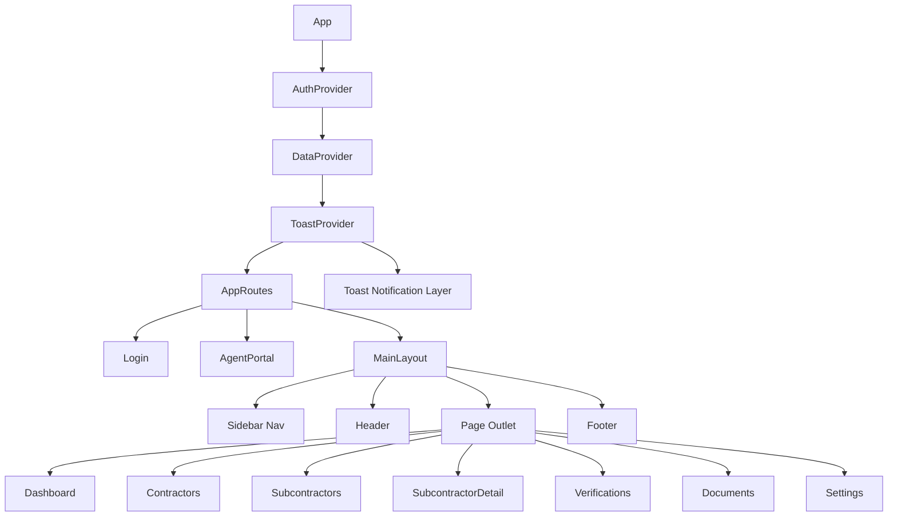
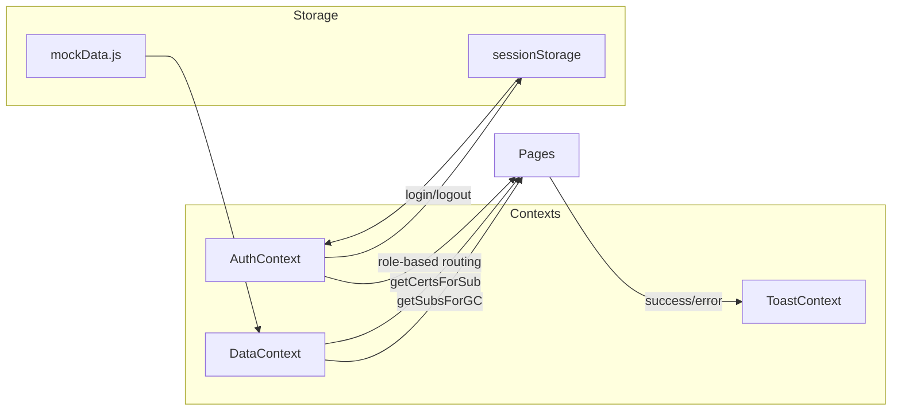
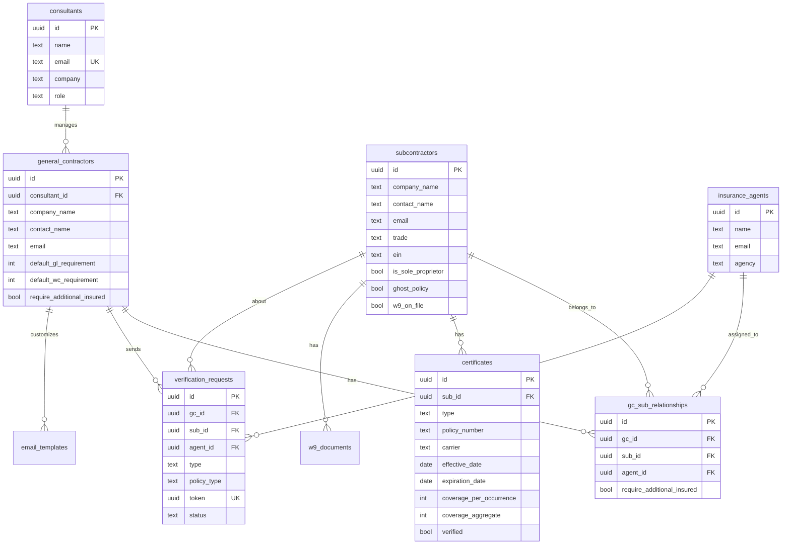

# CoverVerifi — Technical Documentation

## Architecture Overview

CoverVerifi is a single-page application (SPA) built with React 18, React Router v7, and TailwindCSS v4. It follows a context-based state management pattern with three primary providers.

```mermaid
graph TD
    A[BrowserRouter] --> B[AuthProvider]
    B --> C[DataProvider]
    C --> D[ToastProvider]
    D --> E[AppRoutes]
    E --> F[/login — Login]
    E --> G[/verify/:token — AgentPortal]
    E --> H[MainLayout — Protected]
    H --> I[/dashboard — Dashboard]
    H --> J[/contractors — Contractors]
    H --> K[/subcontractors — Subcontractors]
    H --> L[/subcontractors/:subId — SubcontractorDetail]
    H --> M[/verifications — Verifications]
    H --> N[/documents — Documents]
    H --> O[/settings — Settings]
```

### Component Hierarchy



## Data Flow



### AuthContext
- Stores current user in state and `sessionStorage` under key `cv_user`
- `login(email, password)` matches against `demoUsers` array
- Exposes `isConsultant` and `isGC` booleans for role-based rendering
- `ProtectedRoute` component redirects unauthenticated users to `/login`

### DataContext
- Wraps all mock data arrays in React state
- Provides read helpers: `getSubsForGC(gcId)`, `getGCsForConsultant(consultantId)`, `getCertsForSub(subId)`, `getAgentForSub(subId, gcId)`, `getVRsForSub(subId)`
- Provides write helpers: `addSubcontractor()`, `addGC()`, `sendVerification()`
- Auto-generates IDs and timestamps for new records
- Appends to `activityLog` on mutations

### ToastContext
- Maintains a queue of toast notifications with auto-incrementing IDs
- Auto-dismiss after configurable duration (4s default, 6s for errors)
- Provides typed helpers: `success()`, `error()`, `info()`, `warning()`

## Data Model



## Compliance Status Engine

Located in `src/utils/helpers.js`, the `getComplianceStatus(subId, requirements)` function is the core logic:

1. **Find certificates**: Filters all certificates for the given sub, sorts by expiration date (newest first), picks the latest GL and WC certs
2. **Per-certificate evaluation**:
   - No certificate → `none` (red)
   - Not verified → `pending` (gray)
   - Ghost policy → `ghost` (amber)
   - Expired (expiration < today) → `expired` (red)
   - Below coverage requirement → `insufficient` (red)
   - Expiring ≤7 days → `expiring` (red)
   - Expiring ≤30 days → `expiring` (amber)
   - Otherwise → `compliant` (green)
3. **Overall status**: Worst of GL and WC using priority weights

## Frontend Architecture

### Routing Structure

| Path | Component | Access |
|------|-----------|--------|
| `/login` | Login | Public |
| `/verify/:token` | AgentPortal | Public |
| `/dashboard` | Dashboard | Authenticated |
| `/contractors` | Contractors | Consultant only |
| `/subcontractors` | Subcontractors | Authenticated |
| `/subcontractors/:subId` | SubcontractorDetail | Authenticated |
| `/verifications` | Verifications | Authenticated |
| `/documents` | Documents | Authenticated |
| `/settings` | Settings | Authenticated |

### State Management
- No external state library — React Context is sufficient for this data model
- Each context is independently consumable via custom hooks (`useAuth`, `useData`, `useToast`)
- Data mutations are handled by callback functions in DataContext that update local state

### Component Patterns
- **Shared components**: `StatusBadge`, `Modal`, `StatsCard`, `SearchInput`, `EmptyState`, `Toast`
- **Layout**: `MainLayout` with responsive sidebar, header, footer
- **Pages**: Each page is self-contained, pulls data via `useData()` hook
- **Forms**: Controlled inputs with inline validation, error display, and toast feedback

## Supabase Migration Plan

### Phase 1: Authentication
- Replace `demoUsers` with Supabase Auth (`auth.signInWithPassword()`)
- Store user role in `auth.users.raw_user_meta_data` or a `profiles` table
- Replace `sessionStorage` with Supabase session management via `@supabase/ssr`

### Phase 2: Database
- Replace mock data arrays with Supabase queries
- Schema is defined in `supabase/schema-stub.sql` — 13 tables with full RLS policies
- Key RLS pattern: consultant sees all GCs under their tenant; GC sees only their own subs

### Phase 3: File Storage
- `certificates` bucket: GL and WC certificate PDFs
- `w9-documents` bucket: Encrypted at rest, stricter access policies
- Upload via Supabase `storage.from('bucket').upload()`

### Phase 4: Email Automation
- Supabase Edge Functions triggered by new subs and cron schedules
- Email delivery via Resend or SendGrid
- Magic link tokens stored in `verification_requests` table with 30-day expiry

### Phase 5: Real-time
- Supabase real-time subscriptions for dashboard updates

## API Integration Points

| Current (Mock) | Future (Supabase) |
|----------------|-------------------|
| `AuthContext.login()` | `supabase.auth.signInWithPassword()` |
| `DataContext.getSubsForGC()` | `supabase.from('gc_sub_relationships').select('*, subcontractors(*)')` |
| `DataContext.addSubcontractor()` | `supabase.from('subcontractors').insert()` |
| `DataContext.sendVerification()` | `supabase.functions.invoke('send-verification')` |
| Upload button (UI only) | `supabase.storage.from('certificates').upload()` |
| Agent portal token lookup | `supabase.functions.invoke('validate-agent-token')` |

## Dependencies

| Package | Version | Purpose |
|---------|---------|---------|
| react | 18.x | UI component library |
| react-dom | 18.x | DOM rendering |
| react-router-dom | 7.x | Client-side routing |
| tailwindcss | 4.x | Utility-first CSS framework |
| @tailwindcss/vite | 4.x | Vite integration for Tailwind |
| lucide-react | latest | SVG icon library |
| vite | 6.x | Build tool and dev server |

## Security Considerations

- **Row-Level Security**: All Supabase tables have RLS with tenant-isolation policies
- **W-9 Encryption**: EIN/SSN encrypted at application level per Idaho Code 28-51-104
- **Magic Links**: UUID v4 tokens, 30-day expiry, single-use recommended
- **Input Validation**: Client-side validation on all forms
- **Content Security**: No user-generated HTML rendering

## Performance

- **Bundle size**: ~97KB gzipped JS, ~7KB gzipped CSS
- **Memoization**: `useMemo` for filtered/sorted lists, compliance calculations
- **Code splitting**: Candidate for `React.lazy()` on page components
- **Virtual scrolling**: Recommended for sub lists exceeding 100 items
